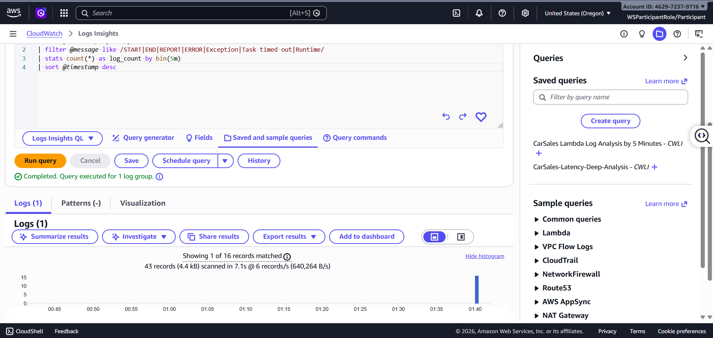

# W6 Evidence Pack — Operations Hardening & Cost-Aware Cloud

---

# Group Information

| Item              | Details                |
| ----------------- | ---------------------- |
| Group ID          | G2                     |
| Project Name      | Car Sales System       |
| Business Domain   | Automotive / Car Sales |
| Presentation Date | 22/05/2026             |

---

# Team Members

| Name                    | Student ID  |
| ----------------------- | ----------- |
| Ngo Huu Tai             | XB-DN26-008 |
| Mai Phuoc Khoa          | XB-DN26-033 |
| Nguyen Tien Hoang Thinh | XB-DN26-047 |
| Dang Thi Ngoc Thao      | XB-DN26-055 |
| Nguyen Phu Trieu        | XB-DN26-070 |
| Nguyen Hung Thinh       | XB-DN26-077 |
| Huynh Ba Huan           | XB-DN26-106 |
| Nguyen Van Tuan Anh     | XB-DN26-112 |
| Le Hoang Viet           | XB-DN26-134 |
| Hoang Cong Tri Dung     | XB-DN26-148 |

---

# Section 1 — Project Recap

## 1.1 Project Overview

### Application Description

The project is a cloud-based car sales management system designed to support vehicle dealerships and customers through a scalable and intelligent web platform. The system allows administrators and sales staff to manage vehicle inventory, customer inquiries, and sales operations, while customers can browse available cars, search based on preferences, and interact with an AI-powered chatbot for recommendations and support.

Target users include:

- Customers searching for vehicles online
- Sales staff managing inquiries and transactions
- System administrators maintaining infrastructure and operations

The platform was designed using AWS cloud-native services with a strong focus on scalability, security, automation, and intelligent customer interaction.

### Main Features

- Car listing management
- Vehicle search and filtering
- Customer inquiry management
- Sales management
- AI-powered recommendation/chatbot system
- User authentication and authorization
- Automated backup and recovery
- Secure API integration
- Monitoring and operational logging

---

## 1.2 Architecture Summary (W1 → W5)

### W1 — Core Architecture

The initial architecture followed a standard 3-tier cloud architecture:

1. Presentation Layer
   - Frontend web application hosted behind CloudFront and Application Load Balancer (ALB)
   - Public access handled through secure HTTPS routing

2. Application Layer
   - EC2 instances deployed in private subnets
   - Auto Scaling Group used for scalability and high availability
   - Application logic processed through Node.js backend services

3. Data Layer
   - Database services isolated inside private subnets (using DocumentDB)
   - Storage and persistent services separated from application instances

The architecture was distributed across multiple Availability Zones to improve fault tolerance and availability.

### W2 — Storage & Identity

Week 2 focused on storage configuration and identity/security management.

Storage services implemented:

- Amazon EBS for EC2 persistent storage
- Amazon EFS for shared file storage across multiple EC2 instances
- Amazon S3 for static assets, backup files, and storage operations

Identity and security setup included:

- IAM Roles for EC2, Lambda, and application services
- Least-privilege access policies
- Security Groups and NACL configuration
- Secure access control between frontend, backend, and database layers
- Controlled resource permissions using IAM policies

This week established the foundation for secure infrastructure operations and shared storage management.

### W3 — Database & AI Layer

Week 3 introduced the database infrastructure and AI-powered application layer.

Implemented services included:

- Amazon DocumentDB for application database storage
- AWS Lambda functions for serverless backend processing
- Amazon Bedrock integration for generative AI capabilities
- Knowledge Base integration for chatbot retrieval and contextual responses

#### Database Layer

Amazon DocumentDB was used as the primary database service for storing:

- Vehicle inventory data
- Customer inquiries
- Sales-related information

The database was deployed inside private subnets within the VPC to improve security and isolate backend resources from direct public access.

#### AI & Automation Layer

The intelligent application layer integrated Amazon Bedrock with backend Lambda functions to support AI-powered customer interactions.

Implemented AI capabilities included:

- Vehicle recommendation support
- Context-aware chatbot responses
- Retrieval-Augmented Generation (RAG)
- Knowledge Base querying
- Backend orchestration using Lambda functions

This architecture enabled intelligent customer support and automated recommendation functionality while maintaining scalable and serverless backend operations.

### W4 — Intelligent Automation

Week 4 focused on building the AI chatbot and intelligent orchestration system.

The chatbot system included:

- Bedrock Agent integration
- Retrieval-based response generation
- Knowledge Base querying
- Lambda-powered tool execution
- Multi-step orchestration workflow

Core chatbot capabilities:

- Vehicle recommendation assistance
- Customer support automation
- Contextual conversation handling
- Intelligent retrieval from stored data
- API-based action execution using Lambda tools

Agent workflow architecture:

1. User submits a request
2. Bedrock Agent processes intent
3. Knowledge Base retrieves related information
4. Lambda tools execute backend operations if required
5. Final response is generated and returned to the user

The system improved customer interaction by automating responses and reducing manual support workload.

### W5 — Network Hardening

Week 5 focused on operational security, backup strategy, and network protection.

Implemented improvements included:

#### Network Security

- VPC segmentation across multiple Availability Zones
- Public and private subnet isolation
- AWS Network Firewall integration
- Secure routing through inspection layers
- NAT Gateway configuration for outbound traffic

#### API & Access Security

- API Gateway integration for controlled API exposure
- Usage plans and throttling configuration
- IAM-based permission control
- Secure communication between services

#### Backup & Restore

- AWS Backup Plan implementation
- EBS snapshot automation
- EFS backup and restore validation
- Data recovery testing and integrity verification

#### Scalability & Reliability

- Auto Scaling Group configuration
- Load balancing using Application Load Balancer
- Multi-AZ deployment for high availability
- Monitoring and logging preparation for operational visibility

The infrastructure was hardened to improve resilience against network threats, operational failures, and scaling challenges.

---

## 1.3 W5 Feedback Improvements

Several issues identified during the W5 review were resolved and improved:

### Backup & Restore Improvements

- Replaced placeholder EBS volumes with actual tagged production volumes inside the backup plan
- Updated backup selection strategy to automatically include newly created instances during scale-out
- Re-ran restore validation to ensure restored data matched original written files
- Verified backup integrity after restore testing

**Vault - Backup Plan - Restore Job**


**EFS Restore**


**ABS Restore**


### Network Firewall Improvements

- Extended AWS Network Firewall coverage beyond Zone A
- Removed direct outbound NAT access from private subnets in other Availability Zones
- Improved inspection routing consistency across multi-AZ architecture


### IAM & Secrets Management Improvements

- Removed database connection strings from Lambda environment variables
- Integrated AWS Secrets Manager for secure secret retrieval
- Updated IAM permissions to allow secure runtime access to secrets

### Concurrency & API Optimization

- Increased Lambda Reserved Concurrency after measuring baseline traffic
- Adjusted concurrency configuration to align with API Gateway usage plan limits
- Reduced risk of unintended request throttling during higher traffic loads

### Documentation & Testing Improvements

- Added CloudFront user-flow screenshots for frontend access validation
- Standardized testing documentation terminology from:
  - “Expected Result”
    to
  - “Observed Result”

---

# Section 2 — MH-COST-V — Cost Visibility & Attribution

## 2.1 Tagging Strategy

### Required Tag Keys

| Tag Key     | Example Value      | Purpose                    |
| ----------- | ------------------ | -------------------------- |
| Owner       | teamlead@email.com | Resource ownership         |
| Environment | dev                | Environment identification |
| CostCenter  | G2                 | Team cost tracking         |
| Application | CarSalesSystem     | Application grouping       |

---

### Allowed Tag Values

| Tag Key     | Allowed Values  |
| ----------- | --------------- |
| Owner       |                 |
| Environment | dev, test, prod |
| CostCenter  | G2              |
| Application | CarSalesSystem  |

---

### Tagging Enforcement Strategy

> Explain how tag consistency would be enforced in a production environment.

---

## 2.2 Resource Tagging Evidence

### Tagged Resources

- EC2 Instances
- RDS Instances
- Lambda Functions
- S3 Buckets
- API Gateway
- EFS File Systems

---

### Screenshot Evidence

> Insert screenshots showing tags applied to at least 3 resource types.

---

## 2.3 Cost Allocation Tags Activation

### Billing Console Activation

> Insert screenshots showing activated cost allocation tags.

---

## 2.4 Cost Monitoring Tools

### Tool 1 — Cost Explorer

> Describe usage and configuration.

### Tool 2 — AWS Budgets

> Describe usage and configuration.

### Tool 3 — Cost Anomaly Detection (Optional)

> Describe usage and configuration.

---

## 2.5 Baseline Cost Breakdown

### Cost Breakdown Screenshot

> Insert screenshot filtered by project tags.

---

### Top Cost Drivers

| Rank | Service | Estimated Cost | Observation |
| ---- | ------- | -------------- | ----------- |
| 1    |         |                |             |
| 2    |         |                |             |
| 3    |         |                |             |

---

### Cost Analysis Observation

> Write a short paragraph explaining major cost drivers and unexpected costs.

---

# Section 3 — MH-COST-A — Cost Control & Action

## 3.1 Objective

The goal of **MH-COST-A** is to prove that our system does not only observe cloud cost, but can also automatically take action to reduce unnecessary spending.

For this workload, we implemented an **Automated Cost Guard** using AWS Lambda. The Lambda function scans running EC2 instances and automatically stops compute resources that should not continue running in a development environment.

The cost guard is connected to two trigger paths:

```text
Path 1 — Scheduled cost control

EventBridge Scheduler
→ CostGuard_Stop_Compute Lambda
→ Stop EC2 instances without keep=true
```

```text
Path 2 — Cost-driven control

AWS Budget $150
→ SNS Topic
→ CostGuard_Stop_Compute Lambda
→ Stop EC2 instances without keep=true
```

This proves that our application stack has an operational cost-control mechanism instead of only a passive cost alert.

---

## 3.2 Automated Cost Guard Lambda

### 3.2.1 Lambda function

| Item            | Value                                   |
| --------------- | --------------------------------------- |
| Lambda name     | `CostGuard_Stop_Compute`                |
| Runtime         | Python                                  |
| AWS SDK         | `boto3`                                 |
| Target resource | EC2 instances                           |
| Action          | `StopInstances`                         |
| Protection rule | Skip EC2 instances with tag `keep=true` |
| Environment     | `dev`                                   |
| Application     | `AAP-CarApp`                            |
| CostCenter      | `G2`                                    |

The Lambda function scans all EC2 instances in the `running` state. For each instance, it checks whether the instance has the tag:

```text
keep=true
```

If the tag is missing, the Lambda treats the instance as a cost-risk resource and stops it using the EC2 `StopInstances` API.

If the tag exists, the Lambda logs the instance as protected and skips it. This prevents important infrastructure such as the bastion host from being stopped accidentally.

### 3.2.2 Lambda code summary

```python
import boto3
import logging

logger = logging.getLogger()
logger.setLevel(logging.INFO)

def lambda_handler(event, context):
    ec2 = boto3.client('ec2')

    logger.info("Scanning for running EC2 instances...")

    ec2_response = ec2.describe_instances(
        Filters=[{'Name': 'instance-state-name', 'Values': ['running']}]
    )

    for reservation in ec2_response.get('Reservations', []):
        for instance in reservation.get('Instances', []):
            instance_id = instance['InstanceId']
            tags = instance.get('Tags', [])

            has_keep = any(
                t.get('Key', '').lower() == 'keep'
                and t.get('Value', '').lower() == 'true'
                for t in tags
            )

            if not has_keep:
                logger.info(f"Stopping EC2 {instance_id} - Missing 'keep=true' tag.")
                ec2.stop_instances(InstanceIds=[instance_id])
            else:
                logger.info(f"Skipping EC2 {instance_id} - Protected by 'keep=true' tag.")

    return {"status": "Automated Cost Guard Executed (EC2 Only)"}
```

### Evidence


---

## 3.3 IAM Least-Privilege Role

The Lambda function uses a dedicated IAM role with only the permissions required for this cost guard.

Required permissions:

```json
{
  "Version": "2012-10-17",
  "Statement": [
    {
      "Sid": "DescribeEC2Instances",
      "Effect": "Allow",
      "Action": ["ec2:DescribeInstances"],
      "Resource": "*"
    },
    {
      "Sid": "StopEC2Instances",
      "Effect": "Allow",
      "Action": ["ec2:StopInstances"],
      "Resource": "*"
    },
    {
      "Sid": "WriteCloudWatchLogs",
      "Effect": "Allow",
      "Action": [
        "logs:CreateLogGroup",
        "logs:CreateLogStream",
        "logs:PutLogEvents"
      ],
      "Resource": "arn:aws:logs:*:*:*"
    }
  ]
}
```

This role does not use `AdministratorAccess`. It only allows the Lambda to describe EC2 instances, stop EC2 instances, and write logs to CloudWatch.

### Evidence


---

## 3.4 Component (b) — Daily EventBridge Schedule

To make the cost guard automatic, we configured an EventBridge Scheduler rule to invoke the Lambda every day.

| Item                | Value                                                |
| ------------------- | ---------------------------------------------------- |
| Scheduler name      | `cost-guard-daily-schedule`                          |
| Target              | `CostGuard_Stop_Compute`                             |
| Schedule type       | Recurring                                            |
| Schedule expression | Daily cron                                           |
| Purpose             | Automatically stop unprotected dev compute resources |
| State               | Enabled                                              |

Example production behavior:

```text
Every day at the scheduled time
→ EventBridge invokes CostGuard_Stop_Compute
→ Lambda scans EC2 running instances
→ Lambda stops EC2 instances without keep=true
```

This prevents development EC2 instances from running idle overnight and helps keep the weekly account cost under the $150 cap.

### Evidence


---

## 3.5 Component (c) — Demonstrated Action

### 3.5.1 Before state

Before invoking the automation, at least one EC2 instance was running and did not have the protection tag:

```text
keep=true
```

Target examples:

| Instance name              | Instance ID           | Initial state | `keep=true` |
| -------------------------- | --------------------- | ------------- | ----------- |
| `car-backend-huutai-a`     | `i-01669f35cc53b5899` | Running       | Missing     |
| Additional unprotected EC2 | `i-04caa3aea23b844ed` | Running       | Missing     |

Protected instance example:

| Instance name              | Instance ID           | State   | Reason                   |
| -------------------------- | --------------------- | ------- | ------------------------ |
| `bastion-backend-huutai-a` | `i-0b11cacc05b1a432e` | Running | Protected by `keep=true` |

### Evidence — Before


### 3.5.2 Lambda execution

The Lambda was invoked and scanned running EC2 instances.

The execution log showed two types of behavior:

```text
Stopping EC2 i-01669f35cc53b5899 - Missing 'keep=true' tag.
Stopping EC2 i-04caa3aea23b844ed - Missing 'keep=true' tag.
Skipping EC2 i-0b11cacc05b1a432e - Protected by 'keep=true' tag.
```

This proves that the Lambda applied selective cost control instead of blindly stopping every instance.

The log evidence for this execution is already captured in:

```text
mh-cost-a-03-lambda-logs-stop-ec2.png
```

### 3.5.3 After state

After the Lambda executed, the unprotected EC2 instances moved from `running` to `stopped`.

| Instance name              | Instance ID           | Final state |
| -------------------------- | --------------------- | ----------- |
| `car-backend-huutai-a`     | `i-01669f35cc53b5899` | Stopped     |
| Additional unprotected EC2 | `i-04caa3aea23b844ed` | Stopped     |
| `bastion-backend-huutai-a` | `i-0b11cacc05b1a432e` | Running     |

The protected bastion instance remained running, proving that the `keep=true` safeguard worked correctly.

### Evidence — After


---

## 3.6 CloudTrail Evidence — StopInstances

CloudTrail recorded the EC2 `StopInstances` API call.

This proves that the EC2 stop action was performed by AWS automation through the Lambda execution role, not manually by a human user.

Important fields to capture:

| Field              | Expected value                                     |
| ------------------ | -------------------------------------------------- |
| Event name         | `StopInstances`                                    |
| Event source       | `ec2.amazonaws.com`                                |
| User identity type | `AssumedRole`                                      |
| Role / session     | Lambda execution role for `CostGuard_Stop_Compute` |
| Resource           | EC2 instance ID that was stopped                   |
| AWS Region         | `us-west-2`                                        |

Example CloudTrail lookup command:

```bash
aws cloudtrail lookup-events \
  --lookup-attributes AttributeKey=EventName,AttributeValue=StopInstances \
  --region us-west-2 \
  --max-results 5
```

### Evidence


---

## 3.7 Component (d) — Cost-Driven Path: AWS Budget → SNS → Lambda

### 3.7.1 AWS Budget

We configured an AWS Budget with a hard workshop cost cap of:

```text
$150
```

The budget is connected to SNS so that cost-related events can trigger the same Lambda cost guard.

| Item                | Value                                |
| ------------------- | ------------------------------------ |
| Budget name         | `group2-budget` or `W6-150-Cost-Cap` |
| Budget amount       | `$150`                               |
| Budget type         | Cost budget                          |
| Notification type   | Actual cost                          |
| Notification target | SNS topic                            |
| SNS topic           | `group2-cost-guard-budget-topic`     |

### Evidence — Budget


---

### 3.7.2 SNS topic and Lambda subscription

The SNS topic is used as the event bridge between AWS Budgets and the Lambda cost guard.

```text
AWS Budget
→ SNS topic
→ CostGuard_Stop_Compute Lambda
```

| Item                  | Value                                             |
| --------------------- | ------------------------------------------------- |
| SNS topic name        | `group2-cost-guard-budget-topic`                  |
| Topic type            | Standard                                          |
| Region                | `us-west-2`                                       |
| Purpose               | Trigger cost guard when budget alert is published |
| Subscription protocol | AWS Lambda                                        |
| Subscription endpoint | `CostGuard_Stop_Compute`                          |
| Subscription status   | Confirmed                                         |

The screenshot for this section includes both the SNS topic overview and the Lambda subscription, so a separate SNS subscription screenshot is not required.

### Evidence — SNS topic and Lambda subscription


---

### 3.7.3 Lambda permission for SNS invoke

The Lambda resource policy allows SNS to invoke the function.

Expected principal:

```text
sns.amazonaws.com
```

Expected source ARN:

```text
arn:aws:sns:us-west-2:462972379716:group2-cost-guard-budget-topic
```

### Evidence


---

## 3.8 Manual SNS Publish Demonstration

Because AWS Budgets cost data can be delayed, the real Budget threshold may not trigger during the 48-hour workshop window. To prove that the cost-driven automation path is wired correctly, we manually published a test message to the SNS topic.

Command used:

```bash
aws sns publish \
  --topic-arn arn:aws:sns:us-west-2:462972379716:group2-cost-guard-budget-topic \
  --message '{"source":"manual-sns-test","reason":"simulate-budget-alert"}' \
  --region us-west-2
```

Expected result:

```text
SNS publish succeeds
→ SNS invokes CostGuard_Stop_Compute
→ Lambda scans running EC2
→ Lambda stops EC2 instances without keep=true
→ CloudTrail records StopInstances
```

The EC2 stopped state is already demonstrated in the main before/after evidence, so an additional EC2 screenshot after SNS publish is not required.

### Evidence — SNS publish


---

## 3.9 ADR — AWS Budgets Cost Data Latency

### Context

AWS Budgets does not always trigger immediately because AWS cost and usage data can be delayed. In a short workshop account that only runs for about 48 hours, the real budget threshold may not fire during the demo window.

### Decision

We still wired the production-like path:

```text
AWS Budget $150
→ SNS topic
→ CostGuard_Stop_Compute Lambda
→ Stop EC2
```

To validate the chain within the workshop timeframe, we manually published a test message to the SNS topic. This simulated a real budget alert event.

### Result

The same Lambda function was invoked through SNS and successfully stopped unprotected EC2 instances. This proves that the cost-driven automation chain works even though the actual AWS Budget alert may not trigger immediately in the lab environment.

### Production behavior

In production, when the actual cost crosses the configured threshold, AWS Budgets would publish to the SNS topic automatically. The same Lambda would then execute and stop non-protected development compute resources to reduce unnecessary cost.

---

## 3.10 Final Summary

The MH-COST-A cost guard demonstrates that our W6 application is cost-aware and operationally controlled.

Instead of only monitoring cost, we implemented an automated action loop:

```text
Detect cost-risk compute
→ decide based on keep=true tag
→ stop unprotected EC2
→ verify through CloudTrail
```

The scheduled path prevents daily idle compute waste. The cost-driven path wires AWS Budget $150 to SNS and Lambda, proving that a budget event can trigger the same stop automation.

This implementation helps keep the workshop account under the $150 cost cap and provides a production-ready pattern for controlling development compute cost.

---

---

# Section 4 — MH-OBS — CloudWatch Observability

## 4.1 Monitoring Strategy

### Application Components Monitored

- API Gateway
- Lambda (CarSales-Search-Service)
- Database (Amazon DocumentDB)
- AI Recommendation Layer
- Vehicle Search Servicef
- Other: CloudWatch Logs & Metrics Engine

---

## 4.2 CloudWatch Dashboard

### Dashboard Overview

The **CarSales-Performance-Dashboard** is designed to provide a comprehensive view of the health and operational efficiency of the vehicle search system. It integrates both core Infrastructure Metrics and custom Application Performance Metrics to enable rapid anomaly detection and proactive troubleshooting.

The dashboard includes the following widgets:

1. **CarSearchLatencyMs (Line Widget):** Monitors real-time latency (in milliseconds) when the Lambda function establishes connections and fetches collection data from the Amazon DocumentDB cluster.
2. **Lambda Duration (Line Widget):** Tracks the average and maximum execution time of the Lambda function to detect potential VPC networking bottlenecks or driver resolution delays.
3. **Lambda Errors (Line Widget):** Monitors the count of execution failures (crashes or timeouts) to assess overall system stability.

---

### Custom Metric Widget

| Metric Name          | Namespace                | Unit         |
| -------------------- | ------------------------ | ------------ |
| `CarSearchLatencyMs` | `CarSalesApp/Operations` | Milliseconds |

---

### Standard Metrics

- Lambda Errors (For `CarSales-Search-Service` function)
- Lambda Duration (`CarSales-Search-Service` Execution Time)
- Amazon DocumentDB Connections (Monitoring open connections within the Private Subnets)

---

### Dashboard Screenshot


---

## 4.3 Custom Metric Implementation

### Metric Description

The tracked metric is **CarSearchLatencyMs**. It measures the total end-to-end duration (in milliseconds) from the moment the Lambda function receives a search request, establishes a secure TLS handshake across the internal VPC network to the Primary Instance of Amazon DocumentDB, and successfully returns the collection names.

Since the Lambda function resides inside a Private Subnet without public Internet access, calling the native `put_metric_data` API would block execution and cause execution timeouts. To solve this, a highly optimized **Log-Based Custom Metric architecture** was implemented. The Lambda function logs structured data in JSON format to CloudWatch Logs, and a **Metric Filter** automatically parses the `$.latency_value` property to publish a dynamic custom metric.

---

### PutMetricData Code Snippet

```python
# Structured JSON logging snippet used for Metric Filter value extraction
import json
import time

start_time = time.time()

# ... Connection logic and db.list_collection_names() from DocumentDB ...

latency_ms = int((time.time() - start_time) * 1000)

# Print structured JSON to stdout for CloudWatch Logs Engine to capture $.latency_value
print(json.dumps({
    "metric_name": "CarSearchLatencyMs",
    "latency_value": latency_ms
}))
```

---

## 4.4 CloudWatch Alarm

### Alarm Configuration

| Setting           | Value                                       |
| ----------------- | ------------------------------------------- |
| Alarm Name        | Lambda-Errors-Alarm                         |
| Metric            | Errors (Standard Lambda Metric)             |
| Threshold         | Greater/equal (>=) 5 errors within 5 minute |
| Evaluation Period | 5 minute (Statistic: Sum)                   |
| Alarm Action      | None / SNS Notification Topic               |

---

### Alarm State

- OK
- ALARM

---

### Alarm Screenshot


---

## 4.5 CloudWatch Logs Insights

### Log Group

/aws/lambda/CarSales-Search-Service

---

### Saved Query Name

CarSales-Latency-Deep-Analysis

---

### Query Purpose

This advanced analytical query scans system execution logs to filter and parse the latency_value attribute from the structured JSON stream. The extracted data points are aggregated into 5-minute time buckets (bin(5m)) to compute: Total Search Volume (TotalSearches), Average Latency (AvgLatencyMs), and Peak Latency (MaxLatencyMs). This allows engineers to easily isolate database connection degradation or spike periods during high traffic.

---

### Logs Insights Query

```sql
fields @timestamp, @message
| filter @message like /START|END|REPORT|ERROR|Exception|Task timed out|Runtime/
| stats count(*) as log_count by bin(5m)
| sort @timestamp desc
```

---

### Query Results Screenshot




---

# Section 5 — MH-SEC — Self-Healing Security Guard

## 5.1 Security Guard Overview

### Security Threat Addressed

> Explain the security misconfiguration detected.

---

### Potential Blast Radius

> Explain production impact if not remediated.

---

## 5.2 Automated Remediation Lambda

### Lambda Purpose

> Describe remediation logic.

---

### Detection Method

- Security Group Detection
- S3 Public Access Detection
- Other:

---

### Remediation Action

> Explain how the Lambda fixes the issue.

---

### IAM Least-Privilege Policy

> Describe permissions granted.

---

### Lambda Screenshot

> Insert screenshots of Lambda code/configuration.

---

## 5.3 Trigger Mechanism

### Trigger Type

- EventBridge Rule
- EventBridge Scheduler

---

### Event Source

> Describe CloudTrail/API event or schedule.

---

### Trigger Screenshot

> Insert screenshots of trigger configuration.

---

## 5.4 Demonstrated Detect → Fix Loop

### Security Violation Scenario

> Describe the intentional security violation.

---

### Before State (Insecure)

> Insert screenshot showing insecure configuration.

---

### Automated Remediation

> Explain remediation flow.

---

### After State (Remediated)

> Insert screenshot showing fixed configuration.

---

### CloudTrail Evidence

> Insert screenshots showing remediation API calls.

---

# Section 5.5 — Supporting Preventive Control

## Selected Path

- Path A — KMS Customer Managed Key
- Path B — S3 Block Public Access + Deny Policy
- Path C — IAM Access Analyzer

---

## Path A — KMS Customer Managed Key

### CMK Configuration

| Setting          | Value |
| ---------------- | ----- |
| Key Alias        |       |
| Rotation Enabled |       |
| Applied Service  |       |

---

### Encryption Usage Evidence

> Insert screenshots and CloudTrail evidence.

---

## Path B — S3 Block Public Access + Deny Policy

### Account-Level Block Public Access

> Insert screenshots showing all settings enabled.

---

### Bucket Policy

```json
// Insert deny policy here
```

---

### Denied Request Evidence

> Insert screenshots showing denied request.

---

## Path C — IAM Access Analyzer

### Findings

> Describe findings identified.

---

### Triage Decision

> Explain whether the access was intended or not.

---

## 5.6 Security-Cost Trade-Off

### Cost Impact

> Explain the cost of the selected control.

---

### Business Justification

> Explain why the cost is justified.

---

# Section 6 — Deployment Demonstration Summary

## MH-COST-V Verification

> Summary of demonstrated cost visibility features.

---

## MH-COST-A Verification

> Summary of automated cost control demonstration.

---

## MH-OBS Verification

> Summary of monitoring and observability evidence.

---

## MH-SEC Verification

> Summary of self-healing security remediation evidence.

---

# Section 7 — Lessons Learned

## Operational Challenges

> Describe major operational issues encountered.

---

## Improvements Made

> Describe optimizations and fixes implemented.

---

## Production Recommendations

> Explain what would be improved in a real production environment.

---

# Section 8 — Stretch Goals (Optional)

## 8.1 gp2 → gp3 Migration

### Before Migration

> Document gp2 configuration and metrics.

---

### After Migration

> Document gp3 configuration and metrics.

---

### Cost & Performance Analysis

> Compare before/after results.

---

## 8.2 Trusted Advisor Remediations

### Finding 1

| Item         | Details |
| ------------ | ------- |
| Finding      |         |
| Action Taken |         |
| Result       |         |

---

### Finding 2

| Item         | Details |
| ------------ | ------- |
| Finding      |         |
| Action Taken |         |
| Result       |         |

---

## 8.3 RI / Savings Plans Analysis

### Break-Even Analysis

> Document calculations and recommendation.

---

## 8.4 Wasteful → Changed Reflection

> Write a 100–150 word reflection describing waste identified and optimization performed.

---

## 8.5 Cost Anomaly Automation

### Configuration

> Describe Cost Anomaly Detection setup.

---

### Alert Flow

> Explain EventBridge → SNS integration.

---

## 8.6 Config Conformance Pack

### Conformance Pack Used

> Specify selected conformance pack.

---

### Compliance Findings

> Summarize important findings.

---
